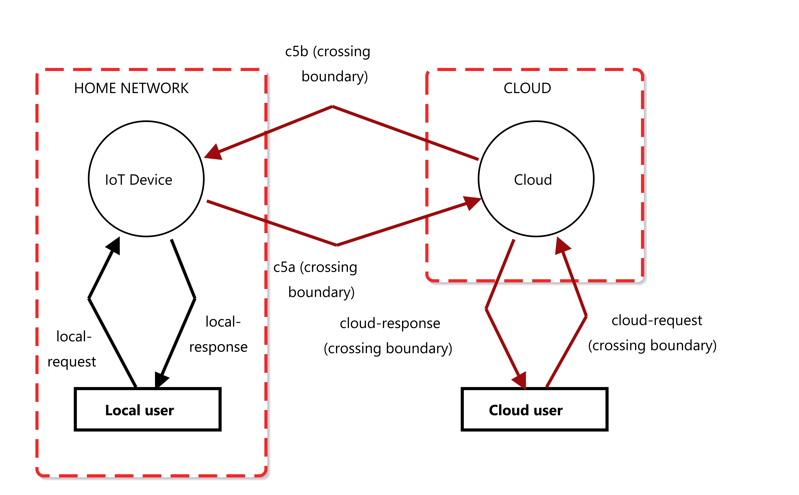

# Threat Model Overview

This repository introduces three distinct threat models for common IoT architectures. Each model presents a unique configuration of components and corresponding security considerations.

---

## 1. Direct Threat Model

In the Direct Threat Model, the IoT devices are not connected to the internet, and only direct communication is possible over a dedicated network.

---

## 2. Cloud/LAN Threat Model

This model uses shared or general-purpose gateways instead,  IoT devices connect directly to the internet without a dedicated gateway, enabling communication via the local network or through a cloud platform.

---

## 3. Gateway Threat Model

The Gateway Threat Model illustrates architectures employing a dedicated gateway, where communication with IoT devices occurs via this gateway or a cloud platform.

---
