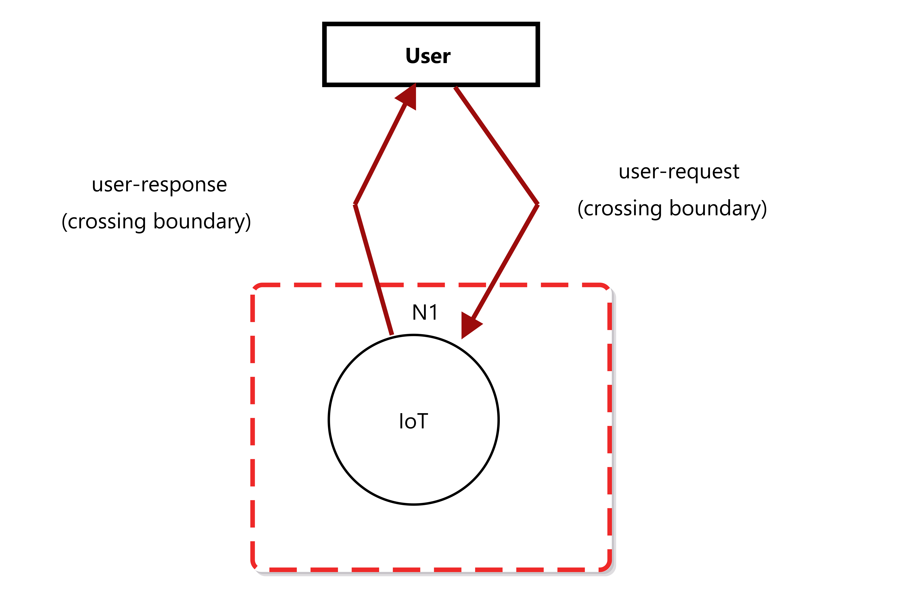
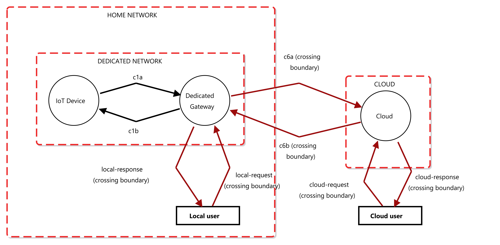

# Threat Model Overview

This repository introduces three distinct threat models relevant to edge and gateway communication architectures. Each model presents a unique configuration of components and corresponding security considerations.

---

## 1. Edge Direct

In the Edge Direct model, the IoT devices are not connected to the internet, and only direct communication is possible over a dedicated network.

---

## 2. No-DGW (No Dedicated Gateway)

This model uses shared or general-purpose gateways instead,  IoT devices connect directly to the internet without a dedicated gateway, enabling communication via the local network or through a cloud platform.

---

## 3. DGW Model (Dedicated Gateway)

The DGW Model illustrates architectures employing a dedicated gateway, where communication with IoT devices occurs via this gateway or a cloud platform.

---